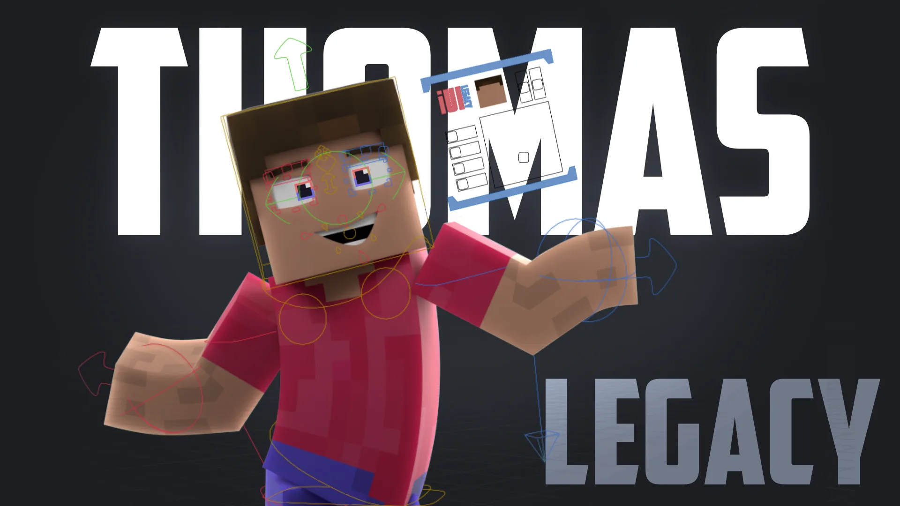

# Thomas Rig Legacy — an advanced character rig in a Minecraft‑style aesthetic

  
  
  
  

  
   
  <em>A versatile, animator‑friendly character rig designed in a block‑based, Minecraft‑style look.</em>

  

---

Elevate your Minecraft animations with this versatile and user-friendly Minecraft Player Rig for Blender! Perfect for both novice and experienced animators, this rig is packed with features to enhance your creative projects:

- **Custom UI**: custom UI to simplify animating and creating presets
- **Custom Armor**: Includes default armor with every possible trim combination, plus unique custom-made armors.
- **Customizable Skins**: Easily replace the default skin with your own using the built-in skin downloader.
- **Advanced Facial Controls**: Create expressive facial animations with detailed controls for the mouth, eyes, and eyebrows.
- **Finger Controls**: Simplified finger rigging for more detailed and realistic hand movements.
- **Easy Appending**: Use the custom append operator in the add menu (`shift-a`) for seamless integration of the rig into your projects.
- **Assets**: an Elytra and Cape Rig is included (and more)
- **Improved Performance**: armor gets appended to save on performance and file size

Download now and start animating!

*Notes:*  
- *This rig is an advanced edit of the Thomas Rig by Thomas Animation, used with permission.*  
- *To use the original Minecraft textures, you must have a legal copy of Minecraft installed on your device (min. ver. 1.21.11). While fallback textures are available, they do not cover all textures.*
- The rig should only be moved in pose mode.

> [!TIP]
> The short [Thomas Rig Legacy Wiki](https://github.com/BlueEvilGFX/thomas-rig-legacy/wiki/) will help you using advanced elements of the rig.

 

